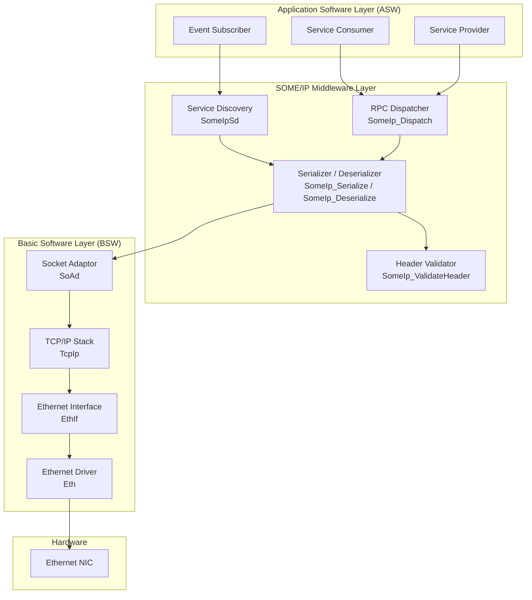
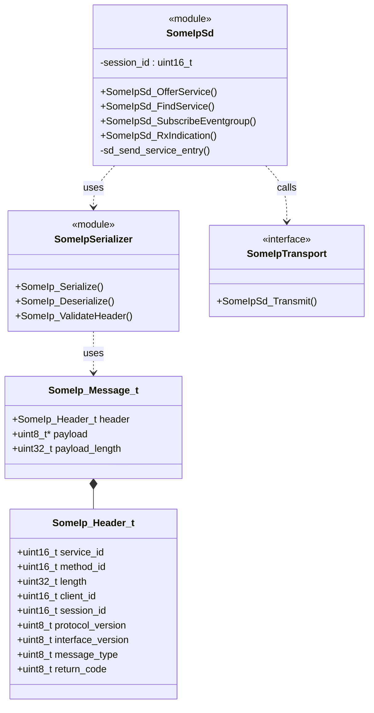
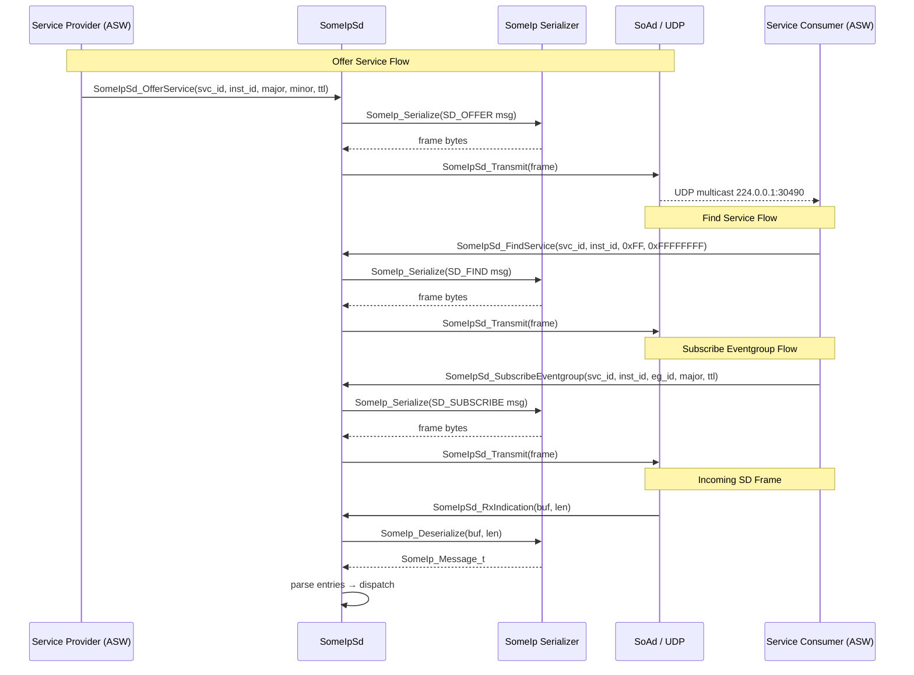

# SOME/IP AUTOSAR Architecture

**Document ID:** SOMEIP-ARCH-001  
**Version:** 1.0  
**Status:** Released  
**ASPICE Relevant Process:** SWE.2 – Software Architectural Design  

---

## 1. Scope

This document defines the software architecture of the SOME/IP middleware stack
implemented in accordance with:

- AUTOSAR PRS_SOMEIPProtocol R22-11
- AUTOSAR PRS_SOMEIPServiceDiscovery R22-11
- AUTOSAR SWS_SOMEIPTransformer R22-11
- ASPICE PAM 3.1 – SWE.2 Software Architectural Design

---

## 2. Layered Architecture Overview



---

## 3. Component Decomposition (SWE.2 – SW Architecture Elements)



---

## 4. Message Sequence – Service Offer / Find / Subscribe



---

## 5. SOME/IP Header Wire Format (PRS_SOMEIP_00030)

```
 0                   1                   2                   3
 0 1 2 3 4 5 6 7 8 9 0 1 2 3 4 5 6 7 8 9 0 1 2 3 4 5 6 7 8 9 0 1
+-+-+-+-+-+-+-+-+-+-+-+-+-+-+-+-+-+-+-+-+-+-+-+-+-+-+-+-+-+-+-+-+
|          Service ID           |           Method ID           |
+-+-+-+-+-+-+-+-+-+-+-+-+-+-+-+-+-+-+-+-+-+-+-+-+-+-+-+-+-+-+-+-+
|                            Length                             |
+-+-+-+-+-+-+-+-+-+-+-+-+-+-+-+-+-+-+-+-+-+-+-+-+-+-+-+-+-+-+-+-+
|           Client ID           |           Session ID          |
+-+-+-+-+-+-+-+-+-+-+-+-+-+-+-+-+-+-+-+-+-+-+-+-+-+-+-+-+-+-+-+-+
| Proto Version | Iface Version |  Message Type |  Return Code  |
+-+-+-+-+-+-+-+-+-+-+-+-+-+-+-+-+-+-+-+-+-+-+-+-+-+-+-+-+-+-+-+-+
|                        Payload (variable)                     |
+-+-+-+-+-+-+-+-+-+-+-+-+-+-+-+-+-+-+-+-+-+-+-+-+-+-+-+-+-+-+-+-+
```

---

## 6. SD Entry Type-1 Wire Format (PRS_SOMEIPSD_00009)

```
 0                   1                   2                   3
 0 1 2 3 4 5 6 7 8 9 0 1 2 3 4 5 6 7 8 9 0 1 2 3 4 5 6 7 8 9 0 1
+-+-+-+-+-+-+-+-+-+-+-+-+-+-+-+-+-+-+-+-+-+-+-+-+-+-+-+-+-+-+-+-+
|     Type      |  Idx 1st Opt  |  Idx 2nd Opt  |#Opts1 |#Opts2 |
+-+-+-+-+-+-+-+-+-+-+-+-+-+-+-+-+-+-+-+-+-+-+-+-+-+-+-+-+-+-+-+-+
|          Service ID           |         Instance ID           |
+-+-+-+-+-+-+-+-+-+-+-+-+-+-+-+-+-+-+-+-+-+-+-+-+-+-+-+-+-+-+-+-+
| Major Version |          TTL (24-bit)                         |
+-+-+-+-+-+-+-+-+-+-+-+-+-+-+-+-+-+-+-+-+-+-+-+-+-+-+-+-+-+-+-+-+
|                        Minor Version                          |
+-+-+-+-+-+-+-+-+-+-+-+-+-+-+-+-+-+-+-+-+-+-+-+-+-+-+-+-+-+-+-+-+
```

---

## 7. Static Memory Budget

| Module               | .text (approx) | .bss/.data     |
|----------------------|----------------|----------------|
| someip_serializer.c  | ~600 bytes      | 0              |
| someip_sd.c          | ~1 200 bytes    | 4 bytes (2× session_id) |
| **Total**            | **~1 800 bytes**| **4 bytes**    |

Stack usage: ~512 bytes peak (SD frame buffer on stack in `sd_send_service_entry`).

---

## 8. ASPICE SWE.2 Traceability

| Architecture Element     | SWE.1 Requirement IDs                          |
|--------------------------|------------------------------------------------|
| SomeIp_Header_t          | SR-SOMEIP-001, SR-SOMEIP-002, SR-SOMEIP-003    |
| SomeIp_Serialize()       | SR-SOMEIP-010, SR-SOMEIP-011                   |
| SomeIp_Deserialize()     | SR-SOMEIP-012, SR-SOMEIP-013, SR-SOMEIP-014    |
| SomeIp_ValidateHeader()  | SR-SOMEIP-015, SR-SOMEIP-016                   |
| SomeIpSd_OfferService()  | SR-SOMEIP-020, SR-SOMEIP-021                   |
| SomeIpSd_FindService()   | SR-SOMEIP-022                                  |
| SomeIpSd_SubscribeEventgroup() | SR-SOMEIP-023, SR-SOMEIP-024             |
| SomeIpSd_RxIndication()  | SR-SOMEIP-025, SR-SOMEIP-026                   |
| SomeIpSd_Transmit (stub) | SR-SOMEIP-030                                  |
