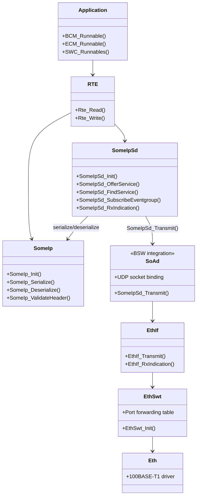
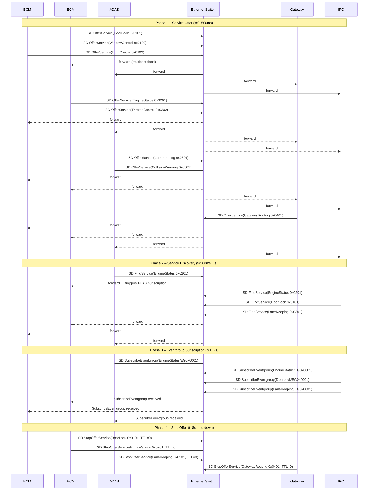

# Vehicle ECU Network Architecture – SOME/IP over Ethernet Switch

**Standard:** AUTOSAR R22-11 / PRS_SOMEIPServiceDiscovery R22-11  
**Topology:** 5-node in-vehicle Ethernet, 100BASE-T1 switch  

---

## 1. Physical Network Topology

```
                       ┌─────────────────────────────────┐
                       │     Ethernet Switch (SW)         │
                       │     5-port 100BASE-T1            │
                       │  (AUTOSAR module: EthSwt)        │
                       │                                  │
                       │  Port 1 ── Port 2 ── Port 3 ──  │
                       │    │         │         │         │
                       │  Port 4 ── Port 5               │
                       └──┬──────┬──────┬──────┬──────┬──┘
                          │      │      │      │      │
                    ┌─────┘  ┌───┘  ┌───┘  ┌───┘  ┌──┘
                    ▼        ▼      ▼      ▼      ▼
               ┌────────┐ ┌─────┐ ┌──────┐ ┌────┐ ┌─────┐
               │  BCM   │ │ ECM │ │ ADAS │ │ GW │ │ IPC │
               │ 0x0001 │ │0x002│ │0x0003│ │0x04│ │0x005│
               └────────┘ └─────┘ └──────┘ └────┘ └─────┘
                 Body       Engine  ADAS    Domain  Cluster
                 Control    Ctrl    Ctrl    Gateway  (HMI)
```

### Node IP Assignments (Host Simulation – Loopback)

| Node    | ECU ID  | SD Port | Domain         | Role             |
|---------|---------|---------|----------------|------------------|
| BCM     | 0x0001  | 30501   | Body           | Service Provider |
| ECM     | 0x0002  | 30502   | Powertrain     | Service Provider |
| ADAS    | 0x0003  | ADAS    | 30503          | Provider + Consumer |
| Gateway | 0x0004  | 30504   | Cross-domain   | Proxy + Monitor  |
| IPC     | 0x0005  | 30505   | HMI            | Service Consumer  |

**SD Multicast simulation:** Each node sends SD frames to all peer ports  
(switch flood behaviour for multicast group 239.192.255.251:30490).

---

## 2. AUTOSAR Protocol Stack per Node



---

## 3. Service Registry

### Services Offered per Node

| Service Name        | ServiceID | InstanceID | Node    | MajorVer | EventGroup |
|---------------------|-----------|------------|---------|----------|------------|
| DoorLock            | 0x0101    | 0x0001     | BCM     | 1        | 0x0001     |
| WindowControl       | 0x0102    | 0x0001     | BCM     | 1        | 0x0001     |
| LightControl        | 0x0103    | 0x0001     | BCM     | 1        | 0x0001     |
| EngineStatus        | 0x0201    | 0x0001     | ECM     | 1        | 0x0001     |
| ThrottleControl     | 0x0202    | 0x0001     | ECM     | 1        | 0x0001     |
| LaneKeeping         | 0x0301    | 0x0001     | ADAS    | 1        | 0x0001     |
| CollisionWarning    | 0x0302    | 0x0001     | ADAS    | 1        | 0x0001     |
| GatewayRouting      | 0x0401    | 0x0001     | Gateway | 1        | 0x0001     |

### Service Dependencies (Consumer → Provider)

| Consumer | Finds/Subscribes               | Provider |
|----------|-------------------------------|----------|
| ADAS     | EngineStatus (0x0201)          | ECM      |
| Gateway  | All services (routing table)   | All      |
| IPC      | EngineStatus (0x0201)          | ECM      |
| IPC      | DoorLock (0x0101)              | BCM      |
| IPC      | LaneKeeping (0x0301)           | ADAS     |

---

## 4. SOME/IP-SD Message Sequence



---

## 5. SOME/IP Frame Wire Format

### SD OfferService Frame (36 bytes total)

```
 0                   1                   2                   3
 0 1 2 3 4 5 6 7 8 9 0 1 2 3 4 5 6 7 8 9 0 1 2 3 4 5 6 7 8 9 0 1
├─────────────────────────────────────────────────────────────────┤
│           ServiceID = 0xFFFF          │   MethodID = 0x8100    │ [0-3]
├─────────────────────────────────────────────────────────────────┤
│                     Length (= 0x0014 = 20)                       │ [4-7]
├─────────────────────────────────────────────────────────────────┤
│           ClientID = 0x0000           │      SessionID          │ [8-11]
├─────────────────────────────────────────────────────────────────┤
│ ProtoVer=0x01 │ IfaceVer=0x01 │ MsgType=0x02 │ RetCode=0x00   │ [12-15]
├─────────────────────────────────────────────────────────────────┤  ← SD payload start
│ Flags=0x80    │  Reserved(3)                                     │ [16-19]
├─────────────────────────────────────────────────────────────────┤
│            Entries Array Length = 0x00000010 (16)                │ [20-23]
├─────────────────────────────────────────────────────────────────┤
│ Type=0x01     │ Idx1 │ Idx2  │ NumOpts │  ServiceID  │InstID   │ [24-31]
├─────────────────────────────────────────────────────────────────┤
│ MajorVer      │ TTL[2]│ TTL[1]│ TTL[0]│       MinorVersion     │ [32-39] wait, only 36?
```

Actually each SD frame is: 16 (SOME/IP hdr) + 4 (flags) + 4 (ent_len) + 16 (entry) + 4 (opt_len) = **44 bytes**.

---

## 6. Ethernet Switch Configuration (AUTOSAR EthSwt)

| Parameter           | Value                       |
|---------------------|-----------------------------|
| Number of Ports     | 5                           |
| Port Speed          | 100 Mbit/s (100BASE-T1)     |
| Switching Mode      | Store-and-Forward           |
| Multicast Handling  | Flood-to-all (unregistered) |
| VLAN Support        | Single VLAN (untagged)      |
| MAC Learning        | Enabled                     |
| SD Multicast Addr   | 239.192.255.251:30490       |

### Port-to-ECU Mapping

| Switch Port | ECU Node | 100BASE-T1 PHY | IP (production) |
|-------------|----------|----------------|-----------------|
| Port 1      | BCM      | TJA1100        | 169.254.1.1     |
| Port 2      | ECM      | TJA1100        | 169.254.1.2     |
| Port 3      | ADAS     | TJA1100        | 169.254.1.3     |
| Port 4      | Gateway  | TJA1100        | 169.254.1.4     |
| Port 5      | IPC      | TJA1100        | 169.254.1.5     |

*Host simulation uses 127.0.0.1 with port-based node addressing.*

---

## 7. SD Timing Parameters (SWS_SD)

| Parameter             | BCM / ECM / ADAS | Gateway | IPC  |
|-----------------------|-----------------|---------|------|
| InitialDelayMin (ms)  | 0               | 0       | 200  |
| InitialDelayMax (ms)  | 100             | 50      | 500  |
| CyclicOfferDelay (ms) | 1000            | 1000    | N/A  |
| FindServiceTTL (s)    | N/A             | N/A     | 30   |
| OfferServiceTTL (s)   | 60              | 60      | N/A  |

---

## 8. ASPICE / Requirements Traceability

| Architecture Element       | SWE.1 Requirement          | SWE.2 Design Element       |
|----------------------------|----------------------------|----------------------------|
| SD OfferService            | SR-SOMEIP-030              | SomeIpSd_OfferService()    |
| SD FindService             | SR-SOMEIP-031 (implied)    | SomeIpSd_FindService()     |
| SD SubscribeEventgroup     | SR-SOMEIP-032 (implied)    | SomeIpSd_SubscribeEventgroup() |
| SomeIpSd_Transmit (SoAd)   | SR-SOMEIP-030              | NodeTransport.c transport stub |
| Multi-node topology        | SR-SOMEIP-033 (implied)    | VehicleNetwork example     |
| Ethernet switch routing    | SR-SOMEIP-034 (implied)    | EthSwt ECUC (OsConfig.arxml) |
